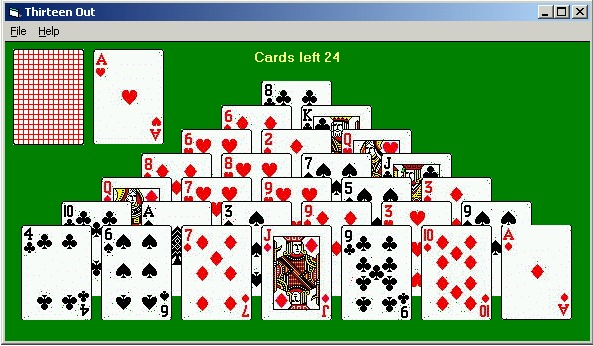



## ThirteenOut

### Description

Thirteen Out is a patience I made to figure out how to draw 3 cards from a number of cards in a deck and in the end of the deck put the last 1-2 cards in the beginning of the deck.

The card values are hold in an array and when you throw one card away I needed to figure out how to rearrange the array. So basically it is a projekt

to figure out the algorithm of moving arrays irregular and still keep track of the correct value.

Although it is a fully functional patience it still need some finishing touches..

Enjoy it

Knoton
 
### More Info
 

             |
---                |---
**Submitted On**   |2001-07-11 19:42:16
**By**             |[Knoton](https://github.com/Planet-Source-Code/PSCIndex/blob/master/ByAuthor/knoton.md)
**Level**          |Intermediate
**User Rating**    |4.7 (14 globes from 3 users)
**Compatibility**  |VB 6\.0
**Category**       |[Games](https://github.com/Planet-Source-Code/PSCIndex/blob/master/ByCategory/games__1-38.md)
**World**          |[Visual Basic](https://github.com/Planet-Source-Code/PSCIndex/blob/master/ByWorld/visual-basic.md)
**Archive File**   |[ThirteenOu225617112001\.zip](https://github.com/Planet-Source-Code/knoton-thirteenout__1-24864/archive/master.zip)

